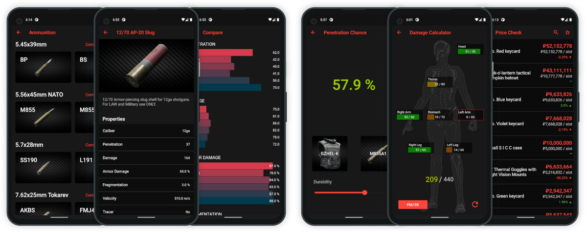

# Battle Buddy for Android

The Android version of unofficial Escape from Tarkov reference app

## Contributing

### Prerequisites

- Familiarity with Git, GitHub [Pull Requests](https://docs.github.com/en/free-pro-team@latest/github/collaborating-with-issues-and-pull-requests/about-pull-requests) and [flow](https://guides.github.com/introduction/flow/)
- Basic knowledge about software development in general, Dart, Flutter and related tools.

### A few rules

- Keep commits atomic and messages as short and concise as possible (ideally it should not exceed 50 characters)
- Pay attention to the code style and formatting. Write as clean as possible, no unnecessary blanks or trailing spaces.
- Write unit tests if possible
- For complex functions, comments should be added

Please make sure beforehand that the topic you want to address has not already been covered. New features should be discussed before, please open an issue.
